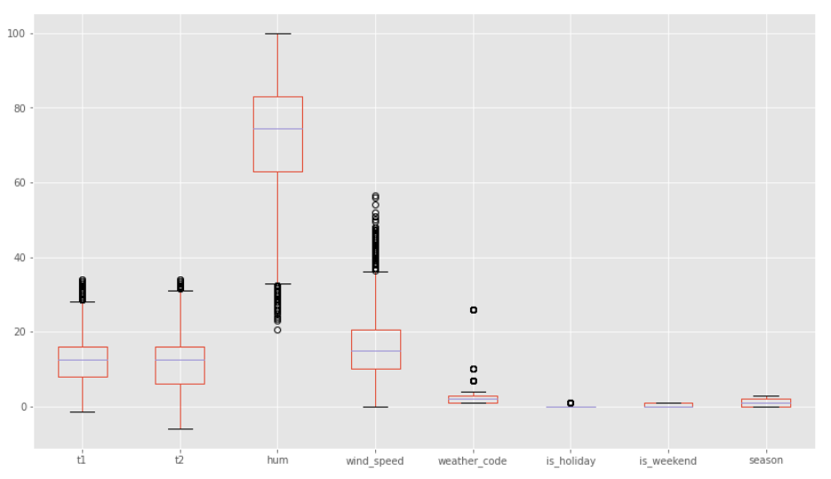
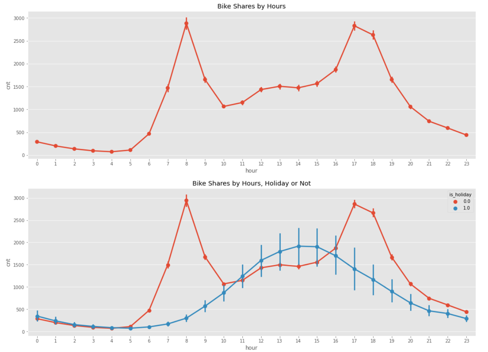

# Demand Prediction Project (Bidirectional LSTM)

Free or affordable access to bicycles has been provided for short-distance trips in an urban area as an alternative to motorized public transport or private vehicles. Thus, it is aimed to reduce traffic congestion, noise and air pollution.

In this project, the goal is to predict the number of future bike shares given the historical data of London bike shares. So this case should be handled as a time series problem with Bidirectional LSTM.

In order to achieve this goal, you will make predictions with LSTM, unlike the machine learning algorithms you have applied before. Long short term memory (LSTM) is an artificial repetitive neural network architecture used in the field of deep learning. Unlike standard feed forward neural networks, LSTM has feedback links. It can process not only single data points but also entire data series.

|Feature | Description|
|---|---|
|timestamp | timestamp field for grouping the data|
|cnt | the count of a new bike shares|
|t1 | real temperature in C|
|t2 | temperature in C “feels like”| 
|hum | humidity in percentage|
|wind_speed | wind speed in km/h|
|weather_code | category of the weather|
|is_holiday | boolean field - 1 holiday / 0 non holiday|
|is_weekend | boolean field - 1 if the day is weekend|
|season | category field meteorological seasons: 0-spring ; 1-summer; 2-fall; 3-winter.|

   

   